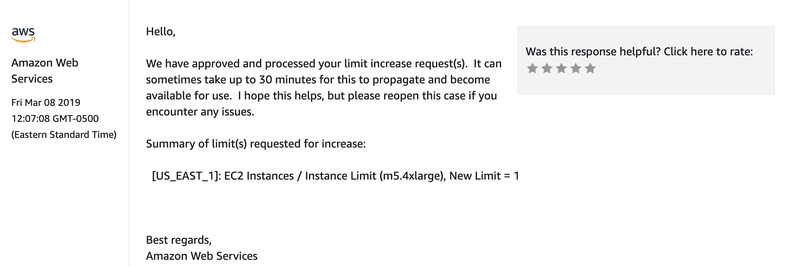
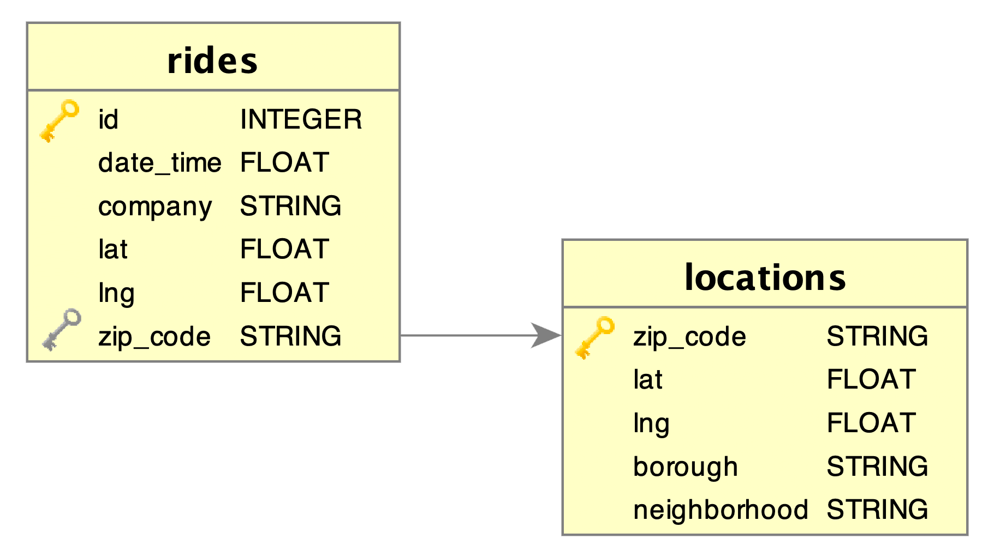
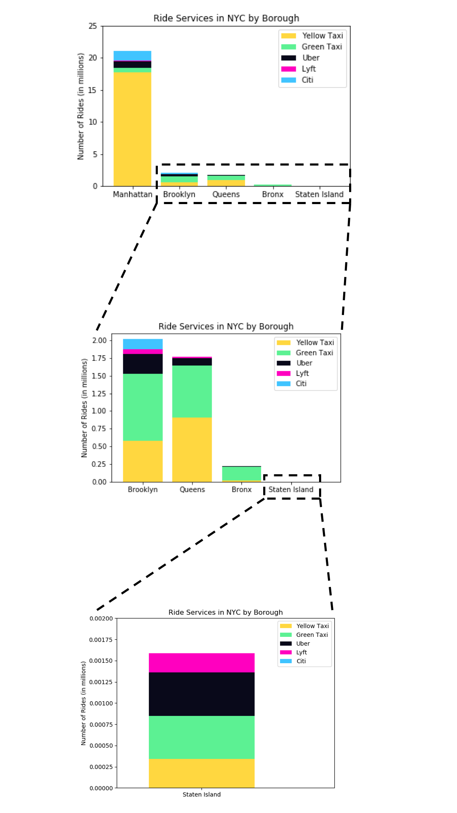

<!-- Uncomment me to start Blog Post 2 (or see what it looks like).

# Blog Post 2
### Some title
---

--- -->

# Blog Post 1
---
_March 15, 2019_

### Introduction
The purpose of this blog is to aid in visualizing and informing users about hidden links between the use of ride services and various aspects of the local environment. Because a large amount of ride service data is available for New York City (NYC), we will focus our analysis on this area.

We're not looking to identify a single data relationship, but rather a set of interesting links between data available in this domain. As such, we hope to end the project with a blog containing multiple visualizations, including explanations of our analyses.

We will be working with a few datasets in our analysis. Namely,
* [New York City Taxi and For-Hire Vehicle Data](https://registry.opendata.aws/nyc-tlc-trip-records-pds/)
* [Citi Bike Trip Histories](https://www.citibikenyc.com/system-data)
* [Uber Pickups in New York City](https://www.kaggle.com/fivethirtyeight/uber-pickups-in-new-york-city)

### Initial Question

For our initial link of investigation, we will be exploring the relationships between the volume of ride services in different boroughs within NYC. This general question will allow us to construct the infrastructure for our data analysis so that we may build upon it with additional investigations.

### Data Collection and Cleaning
Unfortunately, there is little public trip data available for the two main ride services we wanted to look at, Lyft and Uber, unlike the huge amounts of Taxi ride data available. To ensure we can make fair comparisons between all the ride services we have pruned the ride data from all of our ride services to the two-month time range of the trip data available for Lyft. This two-month overlap of data between all the ride services data is August and September 2014.

Similarly, the specificity and organization of the raw trip data for each of the ride service dataset also varied drastically between the datasets for each ride service. To overcome this, we merged all the ride data for the two months from all the datasets into a single rides CSV containing the data that was either present or was inferrable from all of our datasets. This `all_processed_rides.csv` included the following information of each trip: its Unix timestamp, the ride service's name, and the latitude and longitude of the start position of the ride. 

For processing and cleaning all this data to ensure each ride was in the same format, each group member was allocated one of the four ride services and wrote a processing python script specific to that particular datasets structure.  In the end, we processed roughly 32 million rides, where each one consists of a pick-up time and coordinate, as well as the company that provided the service.

### Location
For our first question, we needed to associate each of these rides to an area within New York. To accomplish this, we first scraped a table from [health.gov.ny](https://www.health.ny.gov/statistics/cancer/registry/appendix/neighborhoods.htm) to retrieve a list of boroughs, and then associated zip codes and neighborhoods to these by using Python's [**Beautiful Soup** package](https://www.crummy.com/software/BeautifulSoup/bs4/doc/). 

After that, we looked into using an online reverse geocoding API such as [Google Maps Geocoding-Reverse](https://developers.google.com/maps/documentation/javascript/examples/geocoding-reverse) to retrieve a zip code from each of the rides location coordinates. All of these online APIs had rate limits in the 1000's per day for free and even in their most expensive tiers still would not have supported the 32 million rides we needed to look up.

In the end, after trying out a lot of offline [**reverse geocoding**](https://en.wikipedia.org/wiki/Reverse_geocoding) libraries most of which were not accurate at all, we found this Python package called [**uszipcode**](https://pypi.org/project/uszipcode/) that had an extremely robust offline zip code search engine that seemed to be perfect for our needs. The only issue was that it took around 10 seconds to obtain a zip code for 500 rides... With our ~32 million trips it meant that it would take approximately 180 hours to get a zip code for each ride, way too long.

To speed up the zip code retrieval we first tried to parallelize the python script locally however we quickly realized that our personal machines were not built for these type of workloads and putting them under near 100% load for at least 72 hours was probably not a good idea. We therefore decided to use an Amazon Web Services (AWS) [**Elastic Compute Cloud (EC2)**](https://aws.amazon.com/ec2/) instance instead to increase our parallel processing potential significantly, see below for a screenshot of the communication from Amazon telling our group member that he was now able to use a 64GB ram and 16 core CPU instance that is not enabled by default on basically any AWS account.

After about 12 hours on this proverbial "beast of a machine" (we had to restart the script a couple of times) all 32,209,351 rides in our CSV had a ZIP code associated with them. The next step was translating both our rides CSV and locations CSV into a database for analysis.

The final rides table only has 25,009,005 rides. The reason for this being that we filtered out ~7 million rides with starting locations that were not within the NYC city bounds. For example, many of them started in New Jersey or Upstate New York, but were still in the original NYC datasets.

### Database Schema

For the time being, we are storing our data in an SQLite database, the schema of which is shown below. We will be transitioning our data onto a MySQL database soon, however, to more easily produce interactive visualizations for future blog posts.

### Data Analysis... So Far

<!-- |---------------|-----: |
|Yellow Taxi    |19159254|
|Green Taxi     |2634811|
|Uber           |1427360|
|Lyft           |232764|
|Citi Bikes     |1554816| -->

Even with elementary processing, we can see that the aggregated data shows some interesting travel habits. Manhattan clearly dominates the use of these services, with 80% of the rides originating in that borough. Looking at the proportion of each service used in each area we see substantial differences: Green Taxis were used extensively in the Bronx (84% of rides in that area) and Brooklyn (47%), while relatively little in Manhattan (3.6%). Conversely, the Citi bikes were used exclusively in Manhattan and Brooklyn.

This very simple analysis of our data is meant as a proof-of-concept of work to come. Stay tuned to discover more exciting relationships that may surprise you even more!

### Next Steps

From our analysis, the data shows that the differences across boroughs might be too wide of a scope; therefore, we will investigate across neighborhoods to see how peak volume differs. Additionally, since our data spans across 2 months, we will be narrowing this spectrum to by day and hour to see if we may find any trends.

Looking forward, we aim to integrate additional possible explanatory variables such as average income in a given area of NYC to answer questions related to possible causations of income to ride services. 
