<!-- Uncomment me to start Blog Post 2 (or see what it looks like).

# Blog Post 2
### Some title
---

--- -->

# Midterm Report
_April 5, 2019_

## Introduction
We’re interested in understanding what ridesharing is like in New York City. Does any service dominate across the board, or does each service fit into a geographic niche? How does usage vary over the course of a day or week, and is this pattern similar across services? Do environment variables like the weather effect which services New Yorkers take?

To answer these questions, we cleaned and aggregated a number of datasets to produce a single database of every ride taken with Taxis (Yellow and Green), Uber, Lyft, and Citibikes. We limited our scope to August and September 2014, since this was the only range available in the Lyft dataset. Even for just two months, our database contains 32 million rides!

For each ride, we have geographic coordinates and date/time of the pick-up, as well as the company that provided the service. We used those coordinates to additionally include the zip code of the pick-up. This, in turn, links each ride with its starting neighborhood and borough, enabling us to perform richer, location-based analyses. The diagram below describes our database structure, but far more information on the process and our initial results are described in [Blog Post 1](#blog-post-1)).

This midterm report builds on our previous work to look into two distinct variations in the data. We start by examining how ride usage changes over the course of a day. Then we shift our focus to analyze how weather impacts the travel decisions.

## Weather 

We were curious about how weather impacts the use of ride-sharing services. We decided to restrict our search to Brooklyn because this borough had the most uniform distribution of ride services. This choice mitigates problems related to class-imbalance and makes the analysis more straight-forward.

The weather data for each hour of our two-month period was obtained from the DarkSky API. We recorded the following weather properties for each hour at Brooklyn’s geographic center:

* Precipitation intensity (how much is it raining?)
* Temperature
* Apparent Temperature (how hot does it feel?)
* Dew Point (how humid is it?)
* Wind Speed
* Cloud Cover (how sunny is it?)
* UV Index (how strong is the sun?)

Additionally, for potential classification analysis, we devised labels of sunny, windy, rainy or cloudy for the hourly weather data based on threshold values for different features of the data. More specifically we used the following threshold values:

* __Rain__: Precipitation Intensity > 0.8 mm/hr (Below 0.8 mm/hr precipitation is considered drizzle)
* __Wind__: Wind Speed > 4.0 m/s (Between 3 and 4 on the Beaufort Scale where 3 is considered a gentle breeze and 4 is considered a moderate breeze) 
* __Cloudy__: Cloud Cover (%) > 0.4 
* __Sunny__: Cloud Cover (%) < 0.4 (With the condition that none of the additional weather thresholds for rain or wind are met)

_The above image has been included to comply with the [DarkSky API](https://darksky.net/dev) terms of service._

Our initial hypothesis was that weather would impact the Citibike ride service more compared to other motor vehicle ride services. Intuitively, our assumption was that customers would take into consideration the weather more when riding a bike compared to a motor vehicle. We tested this hypothesis by performing Multiple Linear Regression on the data, with the dependent variable being the number of rides taken with a given company in each hour and the weather data being the independent variables.

How does this help us determine if weather affects one service more than the others? Well, if weather data alone can produce a pretty good estimate of how much use a service gets then the weather has a meaningful effect on New Yorker’s use of that service. The following tables list the coefficients of a model fitted on a particular company. Note the R-squared values, which are highlighted, as a tool for comparison across the services: a higher R-squared means weather captures a greater proportion of the variance in that company’s use.

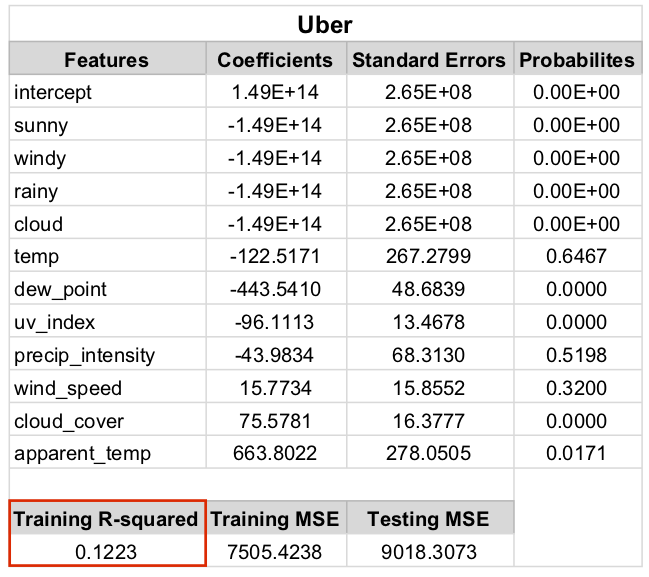
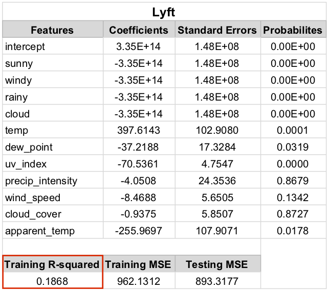
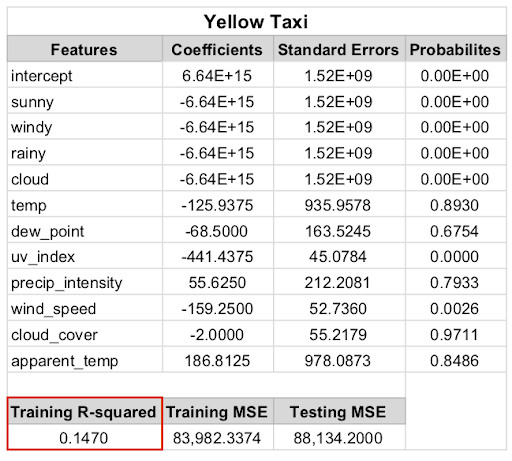
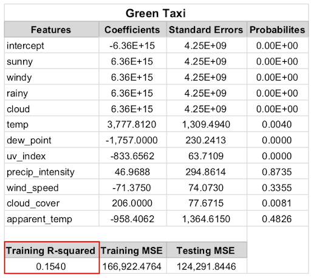
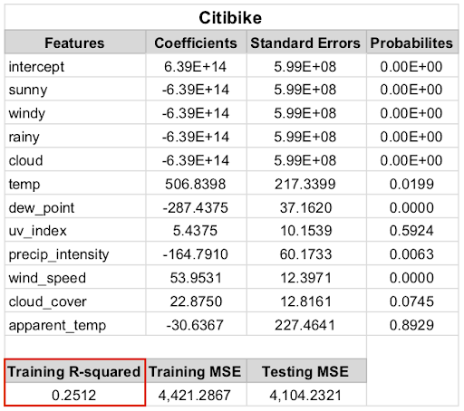

With Citibike having the largest R-squared value by a fair margin (0.251 compared to 0.186 or lower), weather more meaningfully affects bike services than any motor-based service.

The “probabilities” listed in the table communicate how significantly the associated feature affects the fitted equation. The four “artificial” features (sunny, windy, rainy, and cloudy) appear to have zero influence on the model, perhaps because they are direct formulations of some other feature in the list. Dew point and wind speed also have little impact on the use of bikes, implying that New Yorkers don’t let humidity or wind affect when they want to bike. On the other hand, it’s UV Index and particularly apparent temperature that most significantly impacts the use of bikes. This is likely the case because these two variables are highly correlated with the daytime/nighttime cycle; more people are biking in the day (to get to work or enjoy a sunny park) than in the cold, dark hours of the night.

## Time of Day

Focusing on Citibikes in Brooklyn, we were curious to see the volume of rides at various times throughout the day. We predicted that the peak hours of rides would occur during prime commute hours to work (i.e. hours from 7-9) and prime commute hours from work (i.e. hours from 16-19). Additionally, we hypothesized that the volume of rides on a weekend day would be greater than the rides on a given weekday.
 
Our analysis shows that the peak ride hours occur during the hours of 7-9 and 17-19 when averaging rides per hour across each weekday (Monday-Thursday), validating our prediction. Shifting focus to how weekends differ from weekdays, we observe that Saturday and Sunday have more elongated peaks, with substantial usage from 10-19 on average.  Additionally, we note that daily peaks are higher on all weekdays than either weekend day, although high-volume use (>150/hr) is restricted to 4-5 hours on weekdays, but occurs for 8-9 hours on weekends.

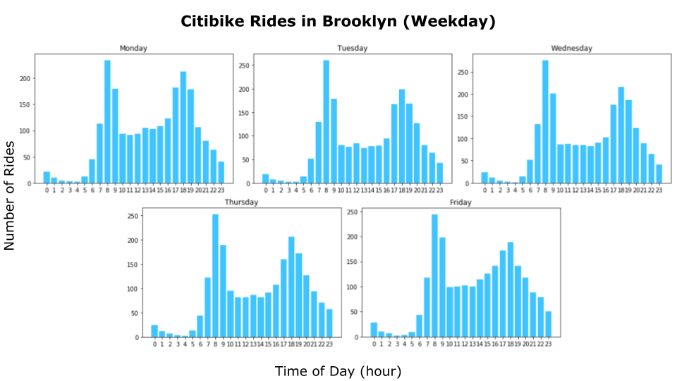
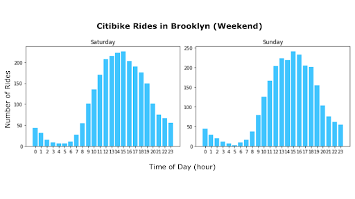

Given that we have data to represent the volume of rides, we wanted to see if we would be able to create a model that would be able to predict ride volume.

To do this, we used [Polynomial Regression](https://en.wikipedia.org/wiki/Polynomial_regression) (a special case of [Multiple Linear Regression](https://en.wikipedia.org/wiki/Linear_regression)) with multiple degrees of freedom to train a model to best predict an estimated volume of rides given any time of day. We used an 80-20 train-test split where our training and testing data consisted of the first 40 and last 20 days respectively.

We tested our model on a random day within our testing data with 3 values of degree of freedom (i.e. 3, 5, and 7). Clearly, the model with 7 degrees of freedom best predicts the volume of rides in a given hour with an MSE of 2306.5 comparatively to degrees 3 and 5.

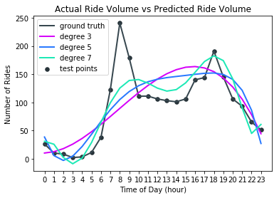
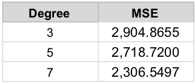

## Discussion

___What is the hardest part of the project that you’ve encountered so far?___

With regards to processing the data, computing power proved to be a challenge for our initial development environment. That is, all our processing was initially computed on local machines. However, the two month period contained information on roughly 32 million rides that needed to be processed and cleaned, which proved too demanding for any of our local machines. Thus, we pivoted towards processing the data on an Amazon Web Services (AWS) Elastic Compute Cloud (EC2) instance instead to increase our parallel processing potential significantly. This gave us the necessary computing power to process the data in a reasonable timeframe. 
 
Building models to analyze patterns in the data and test hypotheses came with its own challenges. The success of any model relies on the useful representation of the data so that it can be processed and analyzed correctly. Likewise, data preprocessing and feature engineering was a challenging intermediary step in building the data pipeline for our models. Take for instance the linear regression model we built for predicting the hourly volume of rides based on varying weather conditions. Initially, we had to create a weather table in our database containing hourly weather conditions over the two month period, assigning each hour to a unique bin number. Then, we had to bin our rides into hourly buckets in our database so that we could associate rides with the correct hourly weather conditions that we collected for the time period. As noted above, we also devised labels of sunny, windy, etc for weather data based on threshold values as well as engineering features. For example, the feature of weekday or weekend was extracted from the data as an important feature for predicting the volume of rides per hour. Thus, we found that preprocessing of the data for insertion into the model was as important as its actual execution.

___What are your initial insights?___

* In 2014, Manhattan dominates use of the ride services with 80% of rides originating in the borough 
* In 2014, out of the five ride services we explored, taxis accounted for the majority of rides across the boroughs. More specifically, yellow taxis accounted for 84% of rides originating in Manhattan while green taxis accounted for 84% and 47% of the rides originating in the Bronx and Brooklyn respectively. 
* Weather conditions have a greater effect on the volume of rides for bike services such as Citi than on car services.
* The volume of rides per hour varies significantly depending on whether the day is a weekday or weekend. 

___Are there any concrete results you can show at this point? If not, why not?___

See [Time of Day](#time-of-day) and [Weather](#weather) sections for results.

___Going forward, what are the current biggest problems you’re facing?___

One significant problem is the narrow time period which we’re working with. Unfortunately, we were only able to obtain a two-month window of Lyft data. Since we want to compare all ride-sharing services fairly, we have had to restrict our analysis to this narrow time period. This has severely restricted the questions we can answer with our data because some variables just don’t change enough over two months.

Another big problem has been the size of the data. For these two months alone, our database contains around 30 million entries (individual rides). This size has meant that any per-row API requests would exceed free-tier quotas (for all services we have looked at), which has reduced our avenues for analysis.

___Do you think you are on track with your project? If not, what parts do you need to dedicate more time to?___

Yes, we feel that we are on track. However, since we don’t have a specific final objective, it’s important that we spend time planning how to build on the analyses we have already done to discover new insights.

___Given your initial exploration of the data, is it worth proceeding with your project, why? If not, how are you going to change your project and why do you think it’s better than your current results?___

Yes, we’re confident that it is worth proceeding with our project. We have already found a number of interesting relationships in the data, and we are sure that there are many more left to be explored.

We plan to use the next phase of the project to focus on what popular pick-up locations tell us about the city and its people. We may investigate some of the following questions:
* Do common pick-up points differ across ride-sharing services?
* Can we pick-up on pick-up spikes around sports games or other large events?
* Is there a relationship between the quality of restaurants and the number of rides started in the area?

---

# Blog Post 1
_March 15, 2019_

## Introduction
The purpose of this blog is to aid in visualizing and informing users about hidden links between the use of ride services and various aspects of the local environment. Because a large amount of ride service data is available for New York City (NYC), we will focus our analysis on this area.

We're not looking to identify a single data relationship, but rather a set of interesting links between data available in this domain. As such, we hope to end the project with a blog containing multiple visualizations, including explanations of our analyses.

We will be working with a few datasets in our analysis. Namely:
* [New York City Taxi and For-Hire Vehicle Data](https://registry.opendata.aws/nyc-tlc-trip-records-pds/)
* [Citi Bike Trip Histories](https://www.citibikenyc.com/system-data)
* [Uber Pickups in New York City](https://www.kaggle.com/fivethirtyeight/uber-pickups-in-new-york-city)

## Initial Question

For our initial link of investigation, we will be exploring the relationships between the volume of ride services in different boroughs within NYC. This general question will allow us to construct the infrastructure for our data analysis so that we may build upon it with additional investigations.

## Data Collection and Cleaning
Unfortunately, there is little public trip data available for the two main ride services we wanted to look at, Lyft and Uber, unlike the huge amounts of Taxi ride data available. To ensure we can make fair comparisons between all the ride services we have pruned the ride data from all of our ride services to the two-month time range of the trip data available for Lyft. This two-month overlap of data between all the ride services data is August and September 2014.

Similarly, the specificity and organization of the raw trip data for each of the ride service dataset also varied drastically between the datasets for each ride service. To overcome this, we merged all the ride data for the two months from all the datasets into a single rides CSV containing the data that was either present or was inferrable from all of our datasets. This `all_processed_rides.csv` included the following information of each trip: its Unix timestamp, the ride service's name, and the latitude and longitude of the start position of the ride. 

For processing and cleaning all this data to ensure each ride was in the same format, each group member was allocated one of the four ride services and wrote a processing python script specific to that particular datasets structure.  In the end, we processed roughly 32 million rides, where each one consists of a pick-up time and coordinate, as well as the company that provided the service.

## Location
For our first question, we needed to associate each of these rides to an area within New York. To accomplish this, we first scraped a table from [health.gov.ny](https://www.health.ny.gov/statistics/cancer/registry/appendix/neighborhoods.htm) to retrieve a list of boroughs, and then associated zip codes and neighborhoods to these by using Python's [**Beautiful Soup** package](https://www.crummy.com/software/BeautifulSoup/bs4/doc/). 

After that, we looked into using an online reverse geocoding API such as [Google Maps Geocoding-Reverse](https://developers.google.com/maps/documentation/javascript/examples/geocoding-reverse) to retrieve a zip code from each of the rides location coordinates. All of these online APIs had rate limits in the 1000's per day for free and even in their most expensive tiers still would not have supported the 32 million rides we needed to look up.

In the end, after trying out a lot of offline [**reverse geocoding**](https://en.wikipedia.org/wiki/Reverse_geocoding) libraries most of which were not accurate at all, we found this Python package called [**uszipcode**](https://pypi.org/project/uszipcode/) that had an extremely robust offline zip code search engine that seemed to be perfect for our needs. The only issue was that it took around 10 seconds to obtain a zip code for 500 rides... With our ~32 million trips it meant that it would take approximately 180 hours to get a zip code for each ride, way too long.

To speed up the zip code retrieval we first tried to parallelize the python script locally however we quickly realized that our personal machines were not built for these type of workloads and putting them under near 100% load for at least 72 hours was probably not a good idea. We therefore decided to use an Amazon Web Services (AWS) [**Elastic Compute Cloud (EC2)**](https://aws.amazon.com/ec2/) instance instead to increase our parallel processing potential significantly, see below for a screenshot of the communication from Amazon telling our group member that he was now able to use a 64GB ram and 16 core CPU instance that is not enabled by default on basically any AWS account.

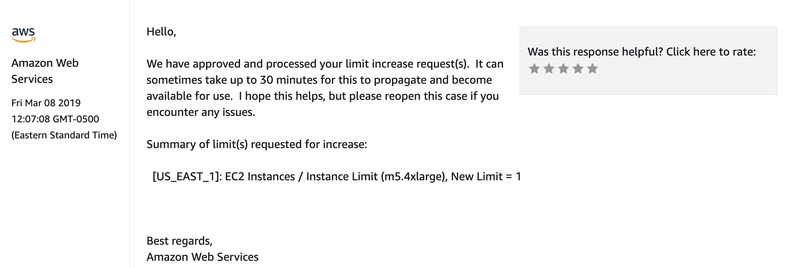

After about 12 hours on this proverbial "beast of a machine" (we had to restart the script a couple of times) all 32,209,351 rides in our CSV had a ZIP code associated with them. The next step was translating both our rides CSV and locations CSV into a database for analysis.

The final rides table only has 25,009,005 rides. The reason for this being that we filtered out ~7 million rides with starting locations that were not within the NYC city bounds. For example, many of them started in New Jersey or Upstate New York, but were still in the original NYC datasets.

## Database Schema

For the time being, we are storing our data in an SQLite database, the schema of which is shown below. We will be transitioning our data onto a MySQL database soon, however, to more easily produce interactive visualizations for future blog posts.

## Data Analysis... So Far

<!-- |---------------|-----: |
|Yellow Taxi    |19159254|
|Green Taxi     |2634811|
|Uber           |1427360|
|Lyft           |232764|
|Citi Bikes     |1554816| -->

Even with elementary processing, we can see that the aggregated data shows some interesting travel habits. Manhattan clearly dominates the use of these services, with 80% of the rides originating in that borough. Looking at the proportion of each service used in each area we see substantial differences: Green Taxis were used extensively in the Bronx (84% of rides in that area) and Brooklyn (47%), while relatively little in Manhattan (3.6%). Conversely, the Citi bikes were used exclusively in Manhattan and Brooklyn.

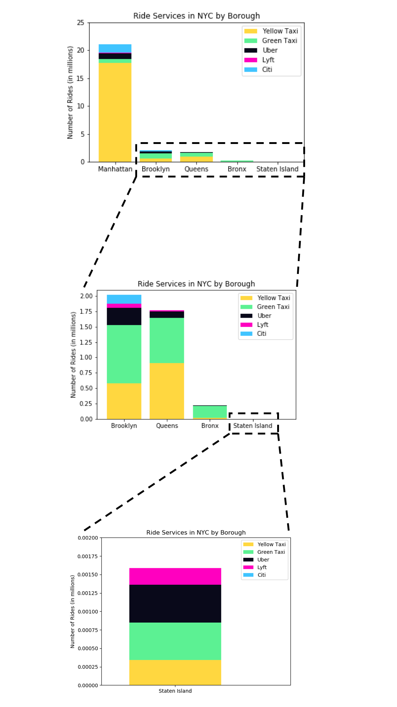

This very simple analysis of our data is meant as a proof-of-concept of work to come. Stay tuned to discover more exciting relationships that may surprise you even more!

## Next Steps

From our analysis, the data shows that the differences across boroughs might be too wide of a scope; therefore, we will investigate across neighborhoods to see how peak volume differs. Additionally, since our data spans across 2 months, we will be narrowing this spectrum to by day and hour to see if we may find any trends.

Looking forward, we aim to integrate additional possible explanatory variables such as average income in a given area of NYC to answer questions related to possible causations of income to ride services. 

---

# Hello World
_March 2, 2019_

Welcome to our [CS1951A - Data Science](https://cs.brown.edu/courses/csci1951-a/) blog! We are going to use this page to highlight interesting parts of our process towards understanding the hidden links between the use of ride services and various aspects of the local environment, particularly in New York City.
