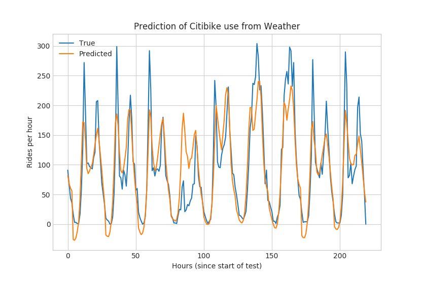
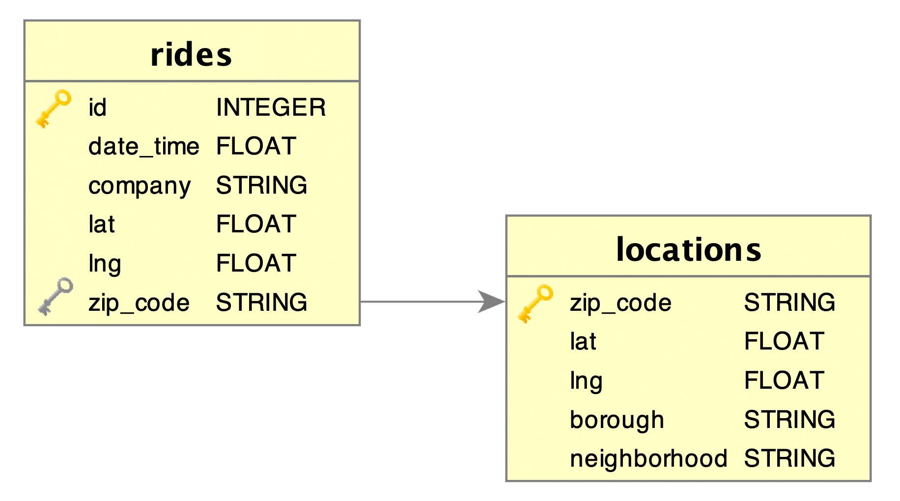

# Final Blog Post!
_May 4, 2019_

## Vision
Initially, our project was centered around the idea of examining interesting relationships among the ride services. To know how far we’ve come, we must first recall where our journey began. Let’s circle back to a couple of relationships we suggested as inquiries in our proposal, which are as follows:

* _Correlation between the use of one or more rideshare services and other variables such as:_
    * _Weather_
    * _Time_  
    * _Availability of other rideshare services_
    * _Demand and Supply of rides_
    * _Location_

* _How have ride services changed over time and where are they heading?_

Reviewing this list, some ideas were borne out of naive optimism for the plethora of data we believed we would have at our disposal. The idea of modeling demand and supply of rides, for example, was quickly put to rest once we realized that we had access to only two months of overlapping data for Lyft and Uber not to mention that the scope of the data didn’t contain the level of detail necessary to model such complex market relationships.

With that said, we feel that we made measurable progress in examining the majority of relationships we set out to explore, engaging with the data both visually and analytically. Recapping our circuitous journey (which we’ll get into more detail below), we delved into location to see how ride services differed over boroughs in NYC. Take a look at the below scatter plot of ride locations overlayed on a map of the NYC boroughs over 12 hours. What’s cool about this is that the scatter plot of rides implicitly defines the explicit outlines of the streets of NYC!

That inquiry revealed the service imbalances within the boroughs as well as the ride volume disparities across the boroughs. This informed our decision to focus on Brooklyn where we examined the temporal relationships of ride volume per hour as well as different days of the week. Eventually, the analysis also evolved into predicting seasonal ride volumes (i.e. another temporal relationship.

From our temporal analysis, we next turned to investigate how the weather might affect the volume of different ride services. Regression analysis led us to focus this inquiry on Citi Bike, building machine learning models to predict ride volume given weather conditions and inversely, predict weather conditions given ride volume.

Thus, we grappled with three of the main relationships we had set forth at the beginning of our journey, finding interesting patterns along the way. Keep reading for a full wrap up on our data, methodology, and results!

## Data

Over the course of this project, we have worked with a lot of data so lets recap some key information about this data in an easy to follow question and answer format:

### What data did we use?

#### Raw Ride Data

* For both Yellow and Green Taxis, we used the [Trip Record Data](https://www1.nyc.gov/site/tlc/about/tlc-trip-record-data.page) provided by the New York City Taxi and Limousine Commission for August and September 2014:
    * [yellow_tripdata_2014-08.csv](https://s3.amazonaws.com/nyc-tlc/trip+data/yellow_tripdata_2014-08.csv)
    * [yellow_tripdata_2014-09.csv](https://s3.amazonaws.com/nyc-tlc/trip+data/yellow_tripdata_2014-09.csv)
    * [green_tripdata_2014-08.csv](https://s3.amazonaws.com/nyc-tlc/trip+data/green_tripdata_2014-08.csv)
    * [green_tripdata_2014-09.csv](https://s3.amazonaws.com/nyc-tlc/trip+data/green_tripdata_2014-09.csv)

* For Uber and Lyft, we used the [Uber Pickups in New York City dataset](https://www.kaggle.com/fivethirtyeight/uber-pickups-in-new-york-city) hosted on Kaggle again for August and September 2014:
    * [uber-raw-data-aug14.csv](https://www.kaggle.com/fivethirtyeight/uber-pickups-in-new-york-city#uber-raw-data-aug14.csv)
    * [uber-raw-data-sep14.csv](https://www.kaggle.com/fivethirtyeight/uber-pickups-in-new-york-city#uber-raw-data-sep14.csv)
    * [Lyft_B02510.csv](https://www.kaggle.com/fivethirtyeight/uber-pickups-in-new-york-city#other-Lyft_B02510.csv)

* For Citi Bike, we used the [monthly trip history data](https://www.citibikenyc.com/system-data) the company themselves provides for the whole 2014 year:
    * [201401-citibike-tripdata.zip](https://s3.amazonaws.com/tripdata/201401-citibike-tripdata.zip)
    * [201402-citibike-tripdata.zip](https://s3.amazonaws.com/tripdata/201402-citibike-tripdata.zip)
    * [201403-citibike-tripdata.zip](https://s3.amazonaws.com/tripdata/201403-citibike-tripdata.zip)
    * [201404-citibike-tripdata.zip](https://s3.amazonaws.com/tripdata/201404-citibike-tripdata.zip)
    * [201405-citibike-tripdata.zip](https://s3.amazonaws.com/tripdata/201405-citibike-tripdata.zip)
    * [201406-citibike-tripdata.zip](https://s3.amazonaws.com/tripdata/201406-citibike-tripdata.zip)
    * [201407-citibike-tripdata.zip](https://s3.amazonaws.com/tripdata/201407-citibike-tripdata.zip)
    * [201408-citibike-tripdata.zip](https://s3.amazonaws.com/tripdata/201408-citibike-tripdata.zip)
    * [201409-citibike-tripdata.zip](https://s3.amazonaws.com/tripdata/201409-citibike-tripdata.zip)
    * [201410-citibike-tripdata.zip](https://s3.amazonaws.com/tripdata/201410-citibike-tripdata.zip)
    * [201411-citibike-tripdata.zip](https://s3.amazonaws.com/tripdata/201411-citibike-tripdata.zip)
    * [201412-citibike-tripdata.zip](https://s3.amazonaws.com/tripdata/201412-citibike-tripdata.zip)

#### Raw Weather Information
* To obtain hourly New York City weather information for the whole 2014 year we used [Dark Sky's API](https://darksky.net/dev) (image included below to comply with terms of service) and corresponding Python package [darkskylib](https://pypi.org/project/darkskylib/).

#### NYC Borough Information
* In order to represent borough information, we created a locations table in our database so we could associate a zip code with the borough that we scraped from [NYC's Department of Health website](https://www.health.ny.gov/statistics/cancer/registry/appendix/neighborhoods.htm).

#### Zip Code information
* For mapping latitude and longitude from our raw data to zip codes, we utilized the Python package [uszipcode](https://pypi.org/project/uszipcode/).

#### Cleaned Data
* During different stages of our project, we used different subsets of the cleaned ride data associated with each rides borough location, binned hour, and weather information for our analysis. Below are links to the major cleaned data SQLite databases and CSV's we used for analysis:
    * [core_all_2014_citibike_brooklyn.db](https://drive.google.com/open?id=148NyCzgPcJ862tDcmPgvVQp8umhKyifp)
    * [core_2_months_brooklyn_all_services.db](https://drive.google.com/open?id=1BAJ7bQG9Ae1oyVSVAnvd3oeA5CQb6fuE)
    * [core_2_months_all_services_all_boroughs.db](https://drive.google.com/open?id=1ajpnPulTf6Bz1JkI_6WiCgDJbDA_rNhI)
    * [2014_brooklyn_only_rides.csv](https://drive.google.com/open?id=1T14EEihFi9IlKnu6zafM_KreracwOB_n)
    * [all_processed_rides.csv](https://drive.google.com/open?id=1o5_mM8tbhaTrJHcASxzX3yuHxC5aD2oM)
    * [brooklyn_weather.csv](https://drive.google.com/open?id=1HqLhknWmm0dJs_G6cR0xzHhLqBsp8kJm)

### Relative to its size was there enough information contained within it?
We wanted to find interesting relationships among the ride services in NYC and were able to achieve this goal even with the limitations of the ride data available for Lyft and Uber not being recent data , spanning across an overlap of two months rather than having access to years worth of data across all ride services.

### Were you able to find what you wanted in the data?
Unfortunately, only the taxi data provided drop off locations, how much time each ride took, and cost for each ride. It would have been an interesting endeavour to find out how far the average rides were and what impacted the cost for each ride service. Overall, the data we collected was sufficient for us to achieve the goals we set out to achieve for the project.

### How did we collect, clean, and integrate it?
After researching and subsequently deciding on our datasets we looked at what information was present among all of them and decided on a standardized format. Each team member took one of the four datasets and cleaned it into a general format (i.e. the UNIX timestamp for the ride, the ride service, and the latitude and longitude coordinates) by using Python scripts each member developed. Once each dataset was cleaned, we combined all the different rides services’ data into one big CSV using a bash script.

Since this ride data only provided latitude and longitude information and we wanted to see which borough each ride was associated with, we had to [reverse geocode](https://en.wikipedia.org/wiki/Reverse_geocoding) it in some way. Due to the magnitude of data (~32 million rides), we decided to use an offline approach using the Python library [uszipcode](https://pypi.org/project/uszipcode/). In order to efficiently process all the rides (i.e. taking ~5 hours rather than ~5 days), we used a powerful AWS EC2 instance to perform the zip code association in parallel. At the end of this process, we had the one big CSV again with an extra column for each rides zip code.

In order to filter out all the rides that did not start within any of the five NYC boroughs, we put this new ride data into a SQLite database alongside another table that associated each NYC Zip Code to an NYC borough (we obtained this information from scraping [NYC's Department of Health website](https://www.health.ny.gov/statistics/cancer/registry/appendix/neighborhoods.htm)). We then performed a natural join across the tables on the zip code column to exclude any rides say that started in New Jersey or in New York but not in NYC, etc. and outputted the result to a CSV from within SQLite. This method of outputting SQL joins to CSV's was how we essentially produced all the different subsets of data we needed for each stage of analysis in the project.

For integrating weather into our data (needed for the regression and machine learning analysis), we had to modify the rides data to be binned into hour groups and add another table detailing the weather statistics focusing on Brooklyn (since it had the most even distribution of the ride services) for each hour in the range of the rides data by using the Dark Sky Api and Python scripts.

In order to create our final visualizations, we used [Seaborn](https://seaborn.pydata.org/) and [Matplotlib](https://matplotlib.org/) but heavily customized the appearance of the graphs to ensure consistency and a more modern design by removing excess line markers, customizing the font-appearance, etc.

**Note**: All of our data manipulation scripts we used throughout the project are categorized into descriptive folder names and can be viewed [here](https://github.com/andydonzelli/cs1951a-blog/tree/master/not-website/scripts).

## Methodology

### Ride Count Analysis

Focusing on the data in Brooklyn since the ride counts were more uniform compared to the other boroughs in NYC, we predicted that the peaks of start ride time would occur during prime commuting hours during the working week and in the middle of the day till late at night for the weekends.

In order to analyze the ride count on a time (i.e hourly) basis, we needed to bin the ride counts into hourly slots based on the given Unix time in the data. Once each ride was binned to a given hour, we separated the data by company, grouped the data points by day, averaged the ride count for a given day of the week.

#### _Results_
Our analysis of the ride counts showed that the peak ride times for ride services during a given weekday were from 7-9 am and 5-10 pm. During a given weekend day, the peak times occurred during the time frame between 7 am - 11 pm. These results validate our proposed predictions of peak times during commuting hours for a weekday and mid-morning till late at night for a weekend day.

### Regression and Weather
Following our exploratory trend, we started to look at types of features that could be affecting the ride services. Naturally, we looked to weather to see if there were any interesting correlations. Intuitively, we hypothesized that the weather would affect Citi Bike more than the other ride services since customers would take into consideration the weather more when riding a bike compared to a motor vehicle.

To test our hypothesis, we gathered weather data for each hour of our two-month period using the Dark Sky API that retrieves weather features given a location for a specific time period. From this, we performed Multiple Linear Regression on our combined ride count and weather data, with the dependent variable being the number of rides for a given company in each hour and the weather features being the independent variable. Namely, the weather features we choose were:

* Apparent Temperature
* Cloud Cover
* Dew Point
* Precipitation Intensity
* Temperature
* UV Index
* Wind Speed

#### _Results_
Taking into consideration the $$R^2$$ values, our analysis shows that the Citi Bike $$R^2$$ value of 0.2512 is almost double than the other values for each other ride service, confirming our initial hypothesis that weather features affect Citi Bike more than the other ride services.

Focusing on the $$p$$-values from the regression, there are a few interesting results from the data. Looking at Citi Bike, weather features _Apparent Temperature_ and _UV Index_ were the most significant features among this ride service while _Precipitation Intensity_ was one of the least significant possibly due to the fact that the data collected was from the Summer months of August and September where it is mostly sunny and there is not much rain. Inversely, _Precipitation Intensity_ was one the most significant features for the motor vehicles that could be due to that when it did rain during the summer, you certainly don’t want to ride a bike.

### Machine Learning Analysis
Now, confident that there is a meaningful relationship between weather and how many New Yorkers choose to take Citi Bikes, we set out to produce an accurate model that could estimate bike usage from the weather. We turned to neural networks because even a simple architecture has the ability to represent very complex relationships between features.

The chosen architecture has two hidden layers of 5 units each, using tanh and elu activation functions respectively. We trained a few variations of this architecture on the same data, and kept the version with the lowest MSE.

The weather data was downloaded with the DarkSky API, giving us an hourly measure of: precipitation intensity, temperature, apparent temperature, dew point, wind speed, cloud cover, and UV index. Since our analysis would focus on Brooklyn’s Citi Bike’s only, we centered the weather requests on Brooklyn. In addition to these metrics, we chose to include, for each “hour” data point, the time-of-day (0-23) and the day-of-week (0-6). Although this weakens our claim that weather alone can predict bike-use, adding these features helps normalize against other aspects of the user’s decisions that aren’t affected by weather (i.e. is it Monday at 8 am and I need to get to work, or is it 4 am I’m sleeping and don’t need a bike no matter the weather).

We produced the ride-count and weather data for each hour of 2014.  The decision was made to split the dataset into 4 “seasons”: Dec-Feb (Winter), Mar-May (Spring), Jun-Aug (Summer), and Sep-Nov (Fall). This again was useful for normalizing the weather to how humans more closely experience it; a cool day in October might still be bikeable (with an October jacket), but in the same temperature in August might have you hailing a taxi. Four separate models were trained on each of the three months of data, and were tested on 10% of each season (about 9 days). Of course, the test data was never used for training. The results of these tests are shown below for the “Spring” and “Fall” seasons.

#### _Results_
These two models performed with MSE scores of 1054 in Spring and 945 in Fall (mean residuals of 32.5 and 30.8 respectively). To better understand how significant the weather was in these estimations, we additionally trained another model on the same architecture and data, except removing weather metrics from the input. The time-of-day and day-of-week “baseline” performed much worse for both seasons: 4390 MSE in Spring and 2630 MSE in Fall (mean residuals of 66 and 51 respectively). This demonstrates that the weather has meaningful effects on the use of Citi Bikes.

Finally, we asked ourselves whether, with such a strong relationship between weather and bike rides, we might be able to estimate the hour’s UV-Index based on the number of rides. Once again, time-of-day and day-of-week were included in the input data, alongside the rides-per-hour. Using the same architecture as above, the model was trained along with the same seasonal splits in data. In this case, the Spring model obtained 0.481 MSE, while the Fall performed at 0.227 MSE. The test results are plotted below.

---

# Blog Post 2
_April 17, 2019_

## Catching you up
As the hip, savvy, blog-enthusiast you are, consumer of all things niche and esoteric, you’ve been following us along our journey into the ride services economy in NYC. But for the sake of thoroughness, let’s recap our journey thus far. 

As you’ll recall, we began our inquiry into the ride services economy in NYC with a broad focus on the major players namely, Uber, Lyft, Citi and taxis. However, data bottlenecks and skewed class distributions forced us to restrict our analysis to the two-month period June 2014 - August 2014 in the borough of Brooklyn, which demonstrated the most reasonably balanced distribution of rides across the different services. 

Given the restrictive timeframe of our data, we wanted to explore the relationship between our ride volumes and another variable that exhibited enough variation along a two-month timespan to constitute a basis for further analysis. That reasoning led us to the question of how weather impacts the use of ride-sharing services. We explored this relationship through linear regression analysis where the main takeaway was a significantly higher R-squared value for Citi Bike compared to the other services which confirmed our intuitive hypothesis that weather more meaningfully affects bike services than any motor-based service.

Our weather analysis served as a springboard for further analysis into Citi Bike, particularly how the volume of rides per hour varies throughout the day and how weekdays might differ from weekends. The main takeaways here were peak ride hours occurred during the commute hours to and from work and ride usage patterns varied noticeably between weekdays and weekends but were largely homogenous within the categories themselves (see midterm report for further details!). 

## Prediction fun with neural networks
Now that we’re all caught up, let’s talk about where we’re heading next. Given the strong relationship between weather and how many New Yorkers choose to use Citi Bike, we asked ourselves: how well can Brooklyn’s weather for a given hour predict how many rides were taken?

We turned to neural networks to model this relationship because even a simple architecture has the ability to represent very complex relationships between features. After some experimentation, we set on a 3-layer feed-forward network, trained with the Adam optimizer on 5000 epochs.

The weather data used was the same as described in the Midterm Report: precipitation intensity, temperature, apparent temperature, dew point, wind speed, cloud cover, and UV index. In addition to these features, we also included the time-of-day (i.e. hours 0-23), and the day of the week (i.e. Mon-Sun maps to 0-6). Although this weakens our claim that weather alone can predict bike-use, adding these features helps normalize against other aspects of the user’s decisions that aren’t affected by weather (is it Monday at 8 am and I need to get to work, or is it 4 am I’m sleeping and don’t need a bike no matter the weather).

The model was trained on the first 85% of the 1464 rows of data (hours in the two months). It was tested on the (entirely unseen) final 15% of the data. These account for about 9 days at the end of the two months. The model’s prediction of these test hours is shown in the figure below:

We’re quite happy with the accuracy of this model, but we decided to take it a step further. If good weather and bike use really do go hand-in-hand, then maybe we might be able to predict the weather from the number of rides taken. We restricted our humble goal of predicting the entire weather to just predicting UV-index. Using a similar model to the one described above, and the same training procedure, we obtained the following results:

## Summary of findings

From our initial results, a strong relationship seems to exist between weather conditions and the Citi Bike usage per hour. With regards to predicting rides per hour based on weather conditions, we can see that our model captures the general pattern of ride volumes per day. On weekdays, we see a peak of rides in the morning, followed by a significant dip in ride volume throughout the day until ride volumes peak again in the late afternoon. On weekends, we generally see a gradual increase in rides throughout the day until it begins to gradually decrease towards the night.  Essentially, we can see each day in our graph delineated by these general ride volume patterns. While the estimation of peak volume of rides per hour by our model differs significantly from the true volume at times, we hope with additional data and further adjustment to our models that we can improve the performance of our model. Nevertheless, the initial results are encouraging. 

Similarly, the inverse relationship of predicting weather (UV index) from Citi Bike ride volumes shows promising results. Generally, our model is fairly accurate in its predictions except for a few cases where it overestimates UV index based on ride volumes. We plan to do additional testing of our model to further validate our initial results. 

## Things to look out for in the final report:

* More details about our neural network architecture and justification for its use.
* The model trained on a whole _year_, instead of just two months. Is the model as accurate in the winter as it is in the summer?

---

# Midterm Report
_April 5, 2019_

## Introduction
We’re interested in understanding what ridesharing is like in New York City. Does any service dominate across the board, or does each service fit into a geographic niche? How does usage vary over the course of a day or week, and is this pattern similar across services? Do environment variables like the weather effect which services New Yorkers take?

To answer these questions, we cleaned and aggregated a number of datasets to produce a single database of every ride taken with Taxis (Yellow and Green), Uber, Lyft, and Citibikes. We limited our scope to August and September 2014, since this was the only range available in the Lyft dataset. Even for just two months, our database contains 32 million rides!

For each ride, we have geographic coordinates and date/time of the pick-up, as well as the company that provided the service. We used those coordinates to additionally include the zip code of the pick-up. This, in turn, links each ride with its starting neighborhood and borough, enabling us to perform richer, location-based analyses. The diagram below describes our database structure, but far more information on the process and our initial results are described in [Blog Post 1](#blog-post-1).

This midterm report builds on our previous work to look into two distinct variations in the data. We start by examining how ride usage changes over the course of a day. Then we shift our focus to analyze how weather impacts the travel decisions.

## Weather 

We were curious about how weather impacts the use of ride-sharing services. We decided to restrict our search to Brooklyn because this borough had the most uniform distribution of ride services. This choice mitigates problems related to class-imbalance and makes the analysis more straight-forward.

The weather data for each hour of our two-month period was obtained from the Dark Sky API. We recorded the following weather properties for each hour at Brooklyn’s geographic center:

* Precipitation intensity (how much is it raining?)
* Temperature
* Apparent Temperature (how hot does it feel?)
* Dew Point (how humid is it?)
* Wind Speed
* Cloud Cover (how sunny is it?)
* UV Index (how strong is the sun?)

Additionally, for potential classification analysis, we devised labels of sunny, windy, rainy or cloudy for the hourly weather data based on threshold values for different features of the data. More specifically we used the following threshold values:

* __Rain__: Precipitation Intensity > 0.8 mm/hr (Below 0.8 mm/hr precipitation is considered drizzle)
* __Wind__: Wind Speed > 4.0 m/s (Between 3 and 4 on the Beaufort Scale where 3 is considered a gentle breeze and 4 is considered a moderate breeze) 
* __Cloudy__: Cloud Cover (%) > 0.4 
* __Sunny__: Cloud Cover (%) < 0.4 (With the condition that none of the additional weather thresholds for rain or wind are met)

_The above image has been included to comply with the [Dark Sky API](https://darksky.net/dev) terms of service._

Our initial hypothesis was that weather would impact the Citibike ride service more compared to other motor vehicle ride services. Intuitively, our assumption was that customers would take into consideration the weather more when riding a bike compared to a motor vehicle. We tested this hypothesis by performing Multiple Linear Regression on the data, with the dependent variable being the number of rides taken with a given company in each hour and the weather data being the independent variables.

How does this help us determine if weather affects one service more than the others? Well, if weather data alone can produce a pretty good estimate of how much use a service gets then the weather has a meaningful effect on New Yorker’s use of that service. The following tables list the coefficients of a model fitted on a particular company. Note the R-squared values, which are highlighted, as a tool for comparison across the services: a higher R-squared means weather captures a greater proportion of the variance in that company’s use.

With Citibike having the largest R-squared value by a fair margin (0.251 compared to 0.186 or lower), weather more meaningfully affects bike services than any motor-based service.

The “probabilities” listed in the table communicate how significantly the associated feature affects the fitted equation. The four “artificial” features (sunny, windy, rainy, and cloudy) appear to have zero influence on the model, perhaps because they are direct formulations of some other feature in the list. Dew point and wind speed also have little impact on the use of bikes, implying that New Yorkers don’t let humidity or wind affect when they want to bike. On the other hand, it’s UV Index and particularly apparent temperature that most significantly impacts the use of bikes. This is likely the case because these two variables are highly correlated with the daytime/nighttime cycle; more people are biking in the day (to get to work or enjoy a sunny park) than in the cold, dark hours of the night.

## Time of Day

Focusing on Citibikes in Brooklyn, we were curious to see the volume of rides at various times throughout the day. We predicted that the peak hours of rides would occur during prime commute hours to work (i.e. hours from 7-9) and prime commute hours from work (i.e. hours from 16-19). Additionally, we hypothesized that the volume of rides on a weekend day would be greater than the rides on a given weekday.
 
Our analysis shows that the peak ride hours occur during the hours of 7-9 and 17-19 when averaging rides per hour across each weekday (Monday-Thursday), validating our prediction. Shifting focus to how weekends differ from weekdays, we observe that Saturday and Sunday have more elongated peaks, with substantial usage from 10-19 on average.  Additionally, we note that daily peaks are higher on all weekdays than either weekend day, although high-volume use (>150/hr) is restricted to 4-5 hours on weekdays, but occurs for 8-9 hours on weekends.

Given that we have data to represent the volume of rides, we wanted to see if we would be able to create a model that would be able to predict ride volume.

To do this, we used [Polynomial Regression](https://en.wikipedia.org/wiki/Polynomial_regression) (a special case of [Multiple Linear Regression](https://en.wikipedia.org/wiki/Linear_regression)) with multiple degrees of freedom to train a model to best predict an estimated volume of rides given any time of day. We used an 80-20 train-test split where our training and testing data consisted of the first 40 and last 20 days respectively.

We tested our model on a random day within our testing data with 3 values of degree of freedom (i.e. 3, 5, and 7). Clearly, the model with 7 degrees of freedom best predicts the volume of rides in a given hour with an MSE of 2306.5 comparatively to degrees 3 and 5.

## Discussion

___What is the hardest part of the project that you’ve encountered so far?___

With regards to processing the data, computing power proved to be a challenge for our initial development environment. That is, all our processing was initially computed on local machines. However, the two month period contained information on roughly 32 million rides that needed to be processed and cleaned, which proved too demanding for any of our local machines. Thus, we pivoted towards processing the data on an Amazon Web Services (AWS) Elastic Compute Cloud (EC2) instance instead to increase our parallel processing potential significantly. This gave us the necessary computing power to process the data in a reasonable timeframe. 
 
Building models to analyze patterns in the data and test hypotheses came with its own challenges. The success of any model relies on the useful representation of the data so that it can be processed and analyzed correctly. Likewise, data preprocessing and feature engineering was a challenging intermediary step in building the data pipeline for our models. Take for instance the linear regression model we built for predicting the hourly volume of rides based on varying weather conditions. Initially, we had to create a weather table in our database containing hourly weather conditions over the two month period, assigning each hour to a unique bin number. Then, we had to bin our rides into hourly buckets in our database so that we could associate rides with the correct hourly weather conditions that we collected for the time period. As noted above, we also devised labels of sunny, windy, etc for weather data based on threshold values as well as engineering features. For example, the feature of weekday or weekend was extracted from the data as an important feature for predicting the volume of rides per hour. Thus, we found that preprocessing of the data for insertion into the model was as important as its actual execution.

___What are your initial insights?___

* In 2014, Manhattan dominates use of the ride services with 80% of rides originating in the borough 
* In 2014, out of the five ride services we explored, taxis accounted for the majority of rides across the boroughs. More specifically, yellow taxis accounted for 84% of rides originating in Manhattan while green taxis accounted for 84% and 47% of the rides originating in the Bronx and Brooklyn respectively. 
* Weather conditions have a greater effect on the volume of rides for bike services such as Citi than on car services.
* The volume of rides per hour varies significantly depending on whether the day is a weekday or weekend. 

___Are there any concrete results you can show at this point? If not, why not?___

See [Time of Day](#time-of-day) and [Weather](#weather) sections for results.

___Going forward, what are the current biggest problems you’re facing?___

One significant problem is the narrow time period which we’re working with. Unfortunately, we were only able to obtain a two-month window of Lyft data. Since we want to compare all ride-sharing services fairly, we have had to restrict our analysis to this narrow time period. This has severely restricted the questions we can answer with our data because some variables just don’t change enough over two months.

Another big problem has been the size of the data. For these two months alone, our database contains around 30 million entries (individual rides). This size has meant that any per-row API requests would exceed free-tier quotas (for all services we have looked at), which has reduced our avenues for analysis.

___Do you think you are on track with your project? If not, what parts do you need to dedicate more time to?___

Yes, we feel that we are on track. However, since we don’t have a specific final objective, it’s important that we spend time planning how to build on the analyses we have already done to discover new insights.

___Given your initial exploration of the data, is it worth proceeding with your project, why? If not, how are you going to change your project and why do you think it’s better than your current results?___

Yes, we’re confident that it is worth proceeding with our project. We have already found a number of interesting relationships in the data, and we are sure that there are many more left to be explored.

We plan to use the next phase of the project to focus on what popular pick-up locations tell us about the city and its people. We may investigate some of the following questions:
* Do common pick-up points differ across ride-sharing services?
* Can we pick-up on pick-up spikes around sports games or other large events?
* Is there a relationship between the quality of restaurants and the number of rides started in the area?

---

# Blog Post 1
_March 15, 2019_

## Introduction
The purpose of this blog is to aid in visualizing and informing users about hidden links between the use of ride services and various aspects of the local environment. Because a large amount of ride service data is available for New York City (NYC), we will focus our analysis on this area.

We're not looking to identify a single data relationship, but rather a set of interesting links between data available in this domain. As such, we hope to end the project with a blog containing multiple visualizations, including explanations of our analyses.

We will be working with a few datasets in our analysis. Namely:
* [New York City Taxi and For-Hire Vehicle Data](https://registry.opendata.aws/nyc-tlc-trip-records-pds/)
* [Citi Bike Trip Histories](https://www.citibikenyc.com/system-data)
* [Uber Pickups in New York City](https://www.kaggle.com/fivethirtyeight/uber-pickups-in-new-york-city)

## Initial Question

For our initial link of investigation, we will be exploring the relationships between the volume of ride services in different boroughs within NYC. This general question will allow us to construct the infrastructure for our data analysis so that we may build upon it with additional investigations.

## Data Collection and Cleaning
Unfortunately, there is little public trip data available for the two main ride services we wanted to look at, Lyft and Uber, unlike the huge amounts of Taxi ride data available. To ensure we can make fair comparisons between all the ride services we have pruned the ride data from all of our ride services to the two-month time range of the trip data available for Lyft. This two-month overlap of data between all the ride services data is August and September 2014.

Similarly, the specificity and organization of the raw trip data for each of the ride service dataset also varied drastically between the datasets for each ride service. To overcome this, we merged all the ride data for the two months from all the datasets into a single rides CSV containing the data that was either present or was inferrable from all of our datasets. This `all_processed_rides.csv` included the following information of each trip: its Unix timestamp, the ride service's name, and the latitude and longitude of the start position of the ride. 

For processing and cleaning all this data to ensure each ride was in the same format, each group member was allocated one of the four ride services and wrote a processing python script specific to that particular datasets structure.  In the end, we processed roughly 32 million rides, where each one consists of a pick-up time and coordinate, as well as the company that provided the service.

## Location
For our first question, we needed to associate each of these rides to an area within New York. To accomplish this, we first scraped a table from [health.gov.ny](https://www.health.ny.gov/statistics/cancer/registry/appendix/neighborhoods.htm) to retrieve a list of boroughs, and then associated zip codes and neighborhoods to these by using Python's [**Beautiful Soup** package](https://www.crummy.com/software/BeautifulSoup/bs4/doc/). 

After that, we looked into using an online reverse geocoding API such as [Google Maps Geocoding-Reverse](https://developers.google.com/maps/documentation/javascript/examples/geocoding-reverse) to retrieve a zip code from each of the rides location coordinates. All of these online APIs had rate limits in the 1000's per day for free and even in their most expensive tiers still would not have supported the 32 million rides we needed to look up.

In the end, after trying out a lot of offline [**reverse geocoding**](https://en.wikipedia.org/wiki/Reverse_geocoding) libraries most of which were not accurate at all, we found this Python package called [**uszipcode**](https://pypi.org/project/uszipcode/) that had an extremely robust offline zip code search engine that seemed to be perfect for our needs. The only issue was that it took around 10 seconds to obtain a zip code for 500 rides... With our ~32 million trips it meant that it would take approximately 180 hours to get a zip code for each ride, way too long.

To speed up the zip code retrieval we first tried to parallelize the python script locally however we quickly realized that our personal machines were not built for these type of workloads and putting them under near 100% load for at least 72 hours was probably not a good idea. We therefore decided to use an Amazon Web Services (AWS) [**Elastic Compute Cloud (EC2)**](https://aws.amazon.com/ec2/) instance instead to increase our parallel processing potential significantly, see below for a screenshot of the communication from Amazon telling our group member that he was now able to use a 64GB ram and 16 core CPU instance that is not enabled by default on basically any AWS account.

After about 12 hours on this proverbial "beast of a machine" (we had to restart the script a couple of times) all 32,209,351 rides in our CSV had a ZIP code associated with them. The next step was translating both our rides CSV and locations CSV into a database for analysis.

The final rides table only has 25,009,005 rides. The reason for this being that we filtered out ~7 million rides with starting locations that were not within the NYC city bounds. For example, many of them started in New Jersey or Upstate New York, but were still in the original NYC datasets.

## Database Schema

For the time being, we are storing our data in an SQLite database, the schema of which is shown below. We will be transitioning our data onto a MySQL database soon, however, to more easily produce interactive visualizations for future blog posts.

## Data Analysis... So Far

<!-- |---------------|-----: |
|Yellow Taxi    |19159254|
|Green Taxi     |2634811|
|Uber           |1427360|
|Lyft           |232764|
|Citi Bikes     |1554816| -->

Even with elementary processing, we can see that the aggregated data shows some interesting travel habits. Manhattan clearly dominates the use of these services, with 80% of the rides originating in that borough. Looking at the proportion of each service used in each area we see substantial differences: Green Taxis were used extensively in the Bronx (84% of rides in that area) and Brooklyn (47%), while relatively little in Manhattan (3.6%). Conversely, the Citi bikes were used exclusively in Manhattan and Brooklyn.

This very simple analysis of our data is meant as a proof-of-concept of work to come. Stay tuned to discover more exciting relationships that may surprise you even more!

## Next Steps

From our analysis, the data shows that the differences across boroughs might be too wide of a scope; therefore, we will investigate across neighborhoods to see how peak volume differs. Additionally, since our data spans across 2 months, we will be narrowing this spectrum to by day and hour to see if we may find any trends.

Looking forward, we aim to integrate additional possible explanatory variables such as average income in a given area of NYC to answer questions related to possible causations of income to ride services. 

---

# Hello World
_March 2, 2019_

Welcome to our [CS1951A - Data Science](https://cs.brown.edu/courses/csci1951-a/) blog! We are going to use this page to highlight interesting parts of our process towards understanding the hidden links between the use of ride services and various aspects of the local environment, particularly in New York City.
